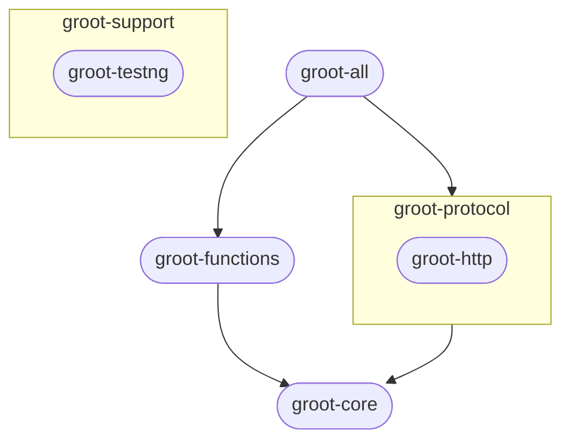
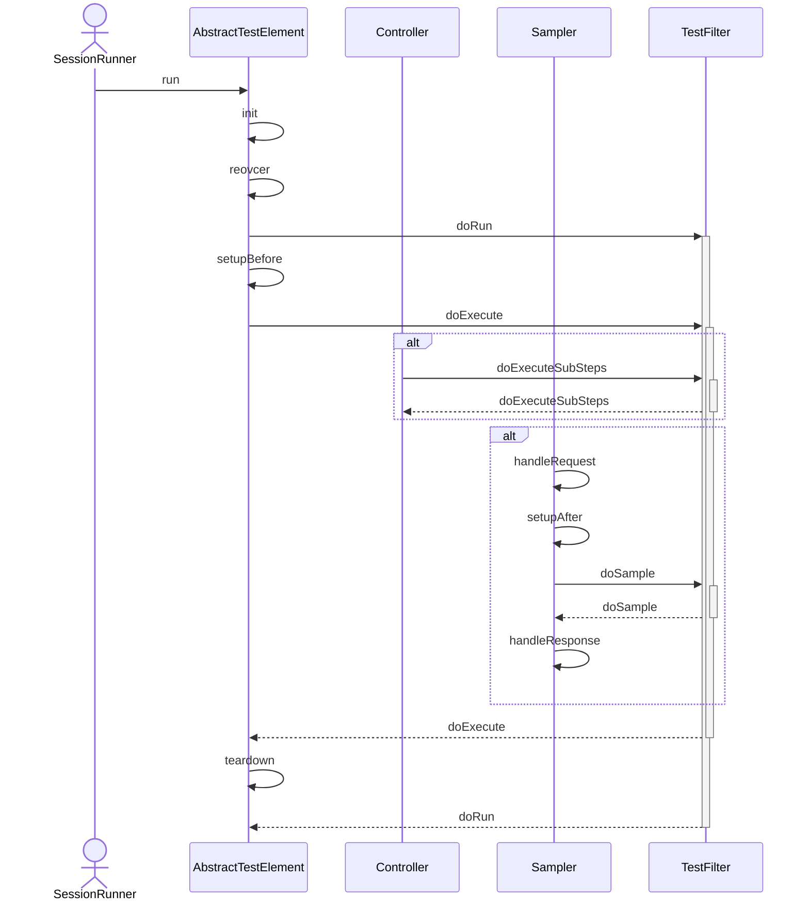

本小节中介绍 Groot 的整体设计和某些技术实现。

## 执行流程图

用户视角的执行流程。

::: tip 温馨提示
Groot 旨在提供底层工具能力，目前不直接支持用例发现和执行，需要配合 TestNG、JUnit 等框架使用，或者自行开发相关功能。后续可能会考虑 CLI 模式，待定。
:::

## 模块划分

当前可用模块之间的关系图如下。

- `groot-all` 包含了所有可用的功能模块。groot-all 依赖 groot-protocol 下所有的模块，所有 groot-protocol 下的模块都会依赖 groot-core 模块。
- `groot-functions` 提供了各种内置函数。
- `groot-http` 提供 HTTP/HTTPS 协议支持。
- `groot-core` 提供核心能力支持，包括了一些内置扩展。
- `groot-testng` 与 TestNG 集成。

## 生命周期

测试元件的生命周期（图中省略了不相关的活动）。

- `init` 执行初始化操作，当第一次调用对象的 run 方法时调用。
- `recover` 执行恢复操作，恢复运行时数据到初始状态（运行时数据可被 TestFilter 修改，但只能修改某些字段）。
- `setupBefore` 执行前置动作（此时关键字属性的值还未计算，仍然是声明时数据，比如 HTTP url 还是模板字符串）
- `setupAfter` 执行前置动作（此时关键字属性的值已计算，比如变量被替换、函数被调用）
- `teardown` 执行后置动作（包括后置处理器、提取器、断言）

